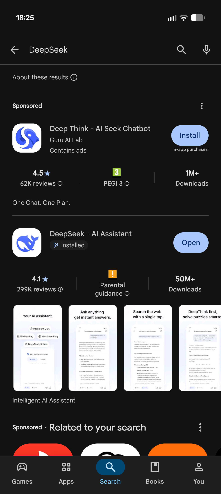
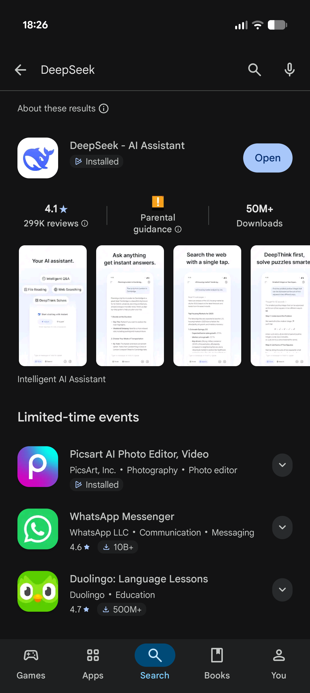

<h1 align="center">
  <picture>
    <!-- banner source: assets/banner_dark_v2.psd -->
    <source media="(prefers-color-scheme: dark)" srcset="assets/banner_dark.png">
    
  </picture>
</h1>

  Xposed module that removes sponsored listings and ads from the Google Play Store.

  
  

## Screenshots

<table>
  <tr>
    <th>Stock</th>
    <th>Patched</th>
  </tr>
  <tr>
    <td></td>
    <td></td>
  </tr>
</table>

## Requirements

- Android 11+ with an arm64-v8a device
- Xposed manager with libxposed API 101+ (102 recommended), such as LSPosed

## Install

1. Install APK from [Releases](../../releases)
2. Enable the module in your Xposed manager, scoped to Google Play Store (`com.android.vending`)
3. Force-stop the Play Store so it restarts with the module active

> [!NOTE]
> If you still see ads or an empty placeholder shelf, clear the Play Store cache, force-stop it, and relaunch. Play Store keeps serving cached ad responses until they refresh.

> [!WARNING]
> Hooking the Play Store can trip Google's device-certification or billing checks on devices without a working Play Integrity setup. This is inherent to modifying the Play Store.

## Related

Also dislike ads in Google Discover, the launcher's -1 screen, or Google News? Try [discover-ads-filter](https://github.com/hxreborn/discover-ads-filter), a sister module.

## License

